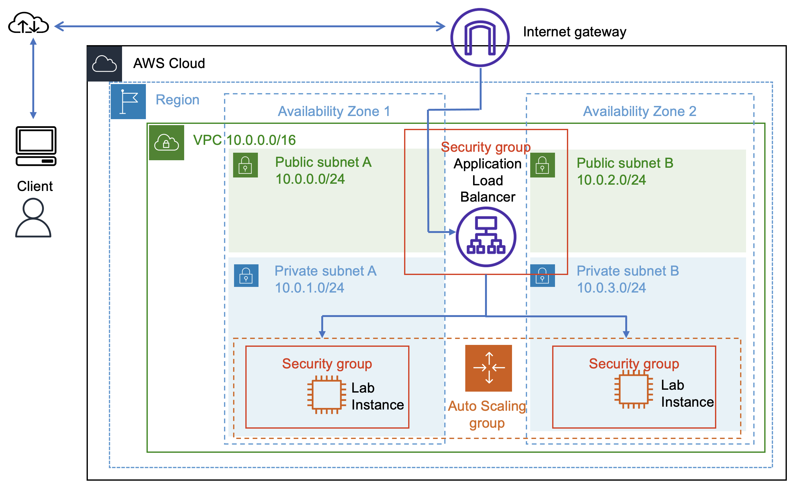
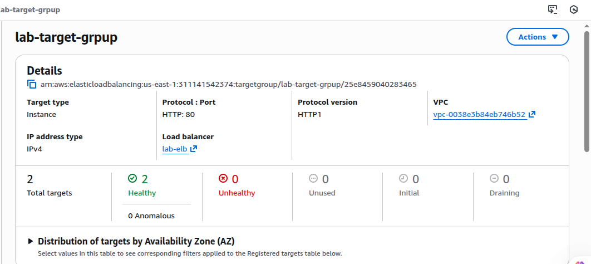
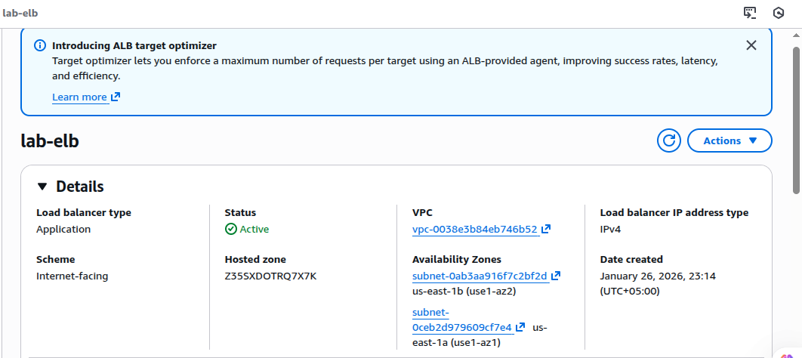
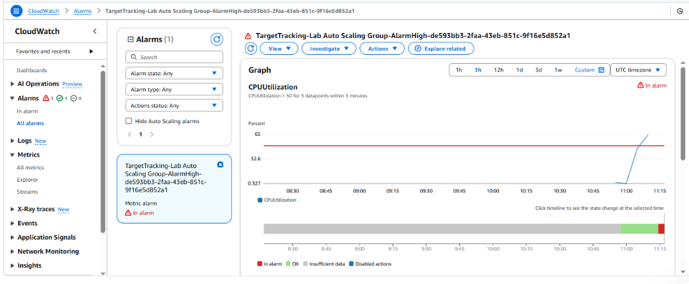
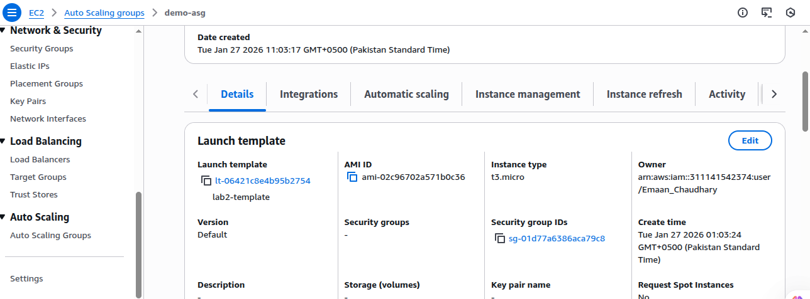

# Highly Available Web Application using AWS ALB & Auto Scaling 🚀

## Problem Statement ⚠️
Single EC2 instances are not reliable for production workloads.  
If the instance fails or traffic spikes, the application becomes unavailable.

This project demonstrates how to design a highly available, scalable, and monitored web application on AWS. 🌐

## Architecture Overview 🏗️
- Application Load Balancer exposed to the internet 🌍  
- EC2 instances running in private subnets 🔒  
- Auto Scaling Group maintains desired capacity 📈  
- CloudWatch alarms trigger scale-in and scale-out ⏱️  

## Key Design Decisions 💡

### Why Load Balancer is in Public Subnets 🌐
The ALB must receive traffic from the internet.  
Private subnets cannot be directly accessed from outside the VPC.  

### Why EC2 Instances are in Private Subnets 🔐
To reduce attack surface.  
Instances are accessed only via the ALB or AWS Systems Manager.  

### Why Launch Template is used 📋
Launch Template ensures every EC2 instance is created with:  
- Same AMI 🖼️  
- Same security group 🛡️  
- Same IAM role 👤  

This enables predictable scaling.  

### Why AMI is created 🏎️
AMI allows faster and consistent instance launches without reinstalling software every time.

## Auto Scaling & Monitoring 📊
- Target tracking policy based on average CPU utilization (50%) 🔥  
- Scale-out when CPU increases ⬆️  
- Scale-in when traffic reduces ⬇️  
- CloudWatch alarms automatically created by ASG ⏰  

  

## Lessons Learned 📝
- Updating a launch template does not affect existing instances ⚠️  
- Auto Scaling Groups only use the latest template for new instances ✅   
- Private subnets improve security but need NAT or VPC endpoints 🌐
